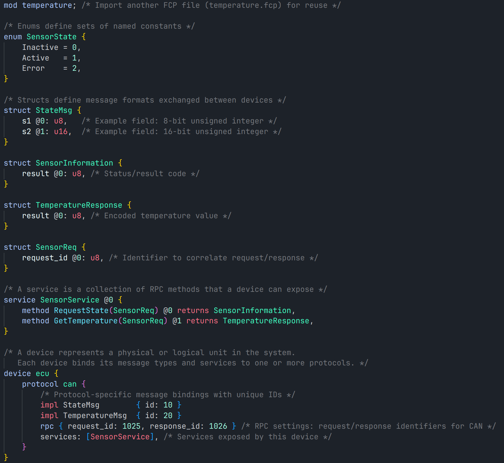

# FST Communication Protocol

FCP is an interface description language to exchange information independently of language and platform.

## Install

	$ pip install fcp

## Example

## Documentation

See [readthedocs.io](https://fcp-core.readthedocs.io/en/latest/)

 * [Contributing](./CONTRIBUTING.md)
 * [Authors](./AUTHORS)
 * [License](./LICENSE)
