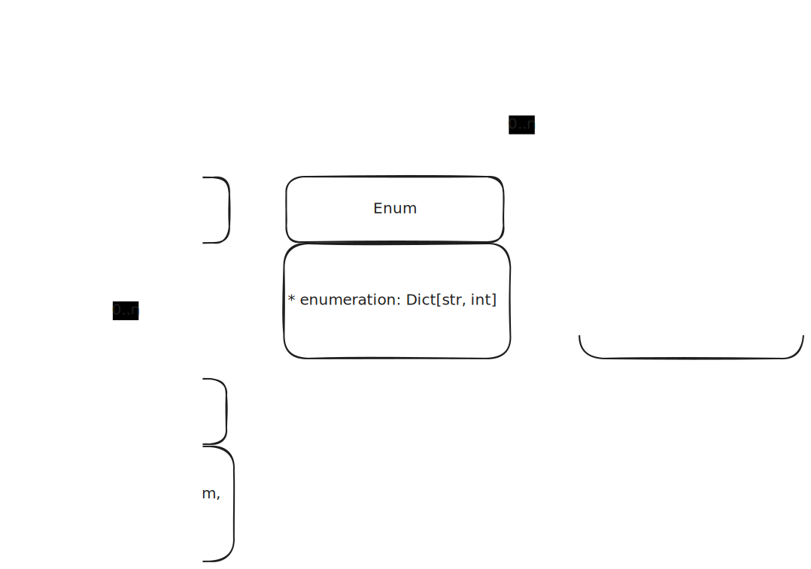

=======
Hacking
=======

Directory structure
===================

.. code-block:: bash

    ├── docs                            - Documentation
    ├── example                         - Example fcp schemas
    ├── plugins                         - Fcp plugins
    │   ├── fcp_can_c                   - CAN C code generator plugin
    │   │   ├── example                 - Example fcp schemas for CAN C
    │   │   ├── fcp_can_c               - Source for fcp_can_c
    │   │   ├── templates               - Jinja templates used for code generation
    │   │   └── tests                   - Unit tests for fcp_can_c
    │   │       ├── 001_basic_struct    - Basic struct test for CAN C
    │   │       ├── 002_nested_enum     - Nested enum test for CAN C
    │   │       ├── 003_msg_scheduling  - Msg scheduling test for CAN C
    │   │       └── 004_little_endian   - Testing little endian encoding for CAN C all data types
    │   │       └── 005_big_endian      - Testing big endian encoding for CAN C all data types
    │   ├── fcp_cpp                     - Example plugin
    │   │   └── fcp_cpp                 - Source for fcp_dbc
    │   ├── fcp_dbc                     - CAN DBC generator
    │   │   ├── example                 - Example fcp schemas for CAN bus
    │   │   ├── fcp_dbc                 - Source for fcp_dbc
    │   │   └── tests                   - Unit tests for fcp_dbc
    │   │       ├── schemas             - Schemas used in fcp_dbc unit tests
    │   ├── fcp_nop                     - Example plugin
    │   │   ├── fcp_nop                 - Source code of fcp_nop
    │   │   └── tests                   - Tests for fcp_nop
    ├── src
    │   └── fcp                         - Fcp source code
    │   │   ├── reflection              - Reflection data
    │       └── specs                   - Fcp object tree
    └── tests                           - Tests for fcp
        └── schemas                     - Schemas used in fcp unit tests
            ├── generator               - Schemas used to test the generator
            └── verifier                - Schemas used to test the verifier

.. code-block:: bash

    src/fcp
    ├── codegen.py           - Support for codegenerator plugins
    ├── colors.py            - Color for terminal output
    ├── encoding.py          - Convert fcp object tree into an encodeable structure
    ├── error_logger.py      - Support for logging errors in fcp
    ├── error.py             - Error class for fcp
    ├── __init__.py
    ├── __main__.py
    ├── maybe.py             - Maybe monad
    ├── reflection.py        - Reflection helper methods
    ├── result.py            - Result monad
    ├── serde.py             - python serialization/deserialization library
    ├── specs                - Fcp object tree
    │   ├── comment.py       - Comment object
    │   ├── device.py        - Device object
    │   ├── enum.py          - Enum object
    │   ├── impl.py          - Impl object
    │   ├── struct_field.py  - Field object
    │   ├── __init__.py
    │   ├── metadata.py      - Metadata object
    │   ├── method.py        - Rpc object
    │   ├── service.py       - Service object
    │   ├── signal_block.py  - Signal block object
    │   ├── struct.py        - Struct object
    │   ├── type.py          - Type object
    │   └── v2.py            - Fcp v2 root
    ├── types.py             - python typing helpers
    ├── type_visitor.py      - Visitor for the fcp type hierarchy
    ├── utils.py             - name convertion utilities
    ├── parser.py         - Fcp v2 parser
    ├── verifier.py          - Post parsing error analysis
    ├── version.py           - fcp version
    └── xpath.py             - Query fcp object tree

