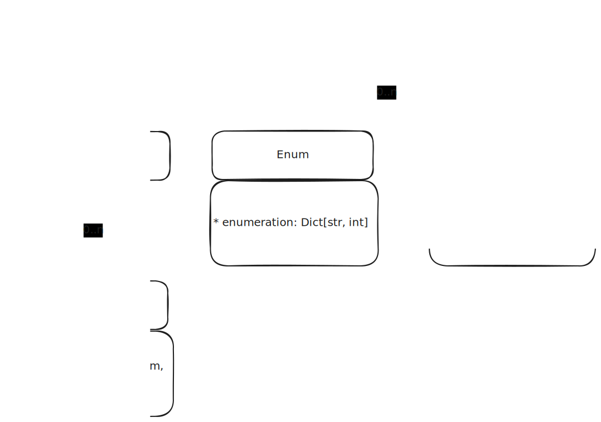

=======
Hacking
=======

Directory structure
===================

.. code-block:: bash

    ├── docs                 - Documentation
    ├── example              - Example fcp schemas
    ├── plugins              - Fcp plugins
    │   ├── fcp_cpp_can      - Example plugin
    │   │   └── fcp_cpp_can  - Source for fcp_dbc
    │   ├── fcp_dbc          - CAN DBC generator
    │   │   ├── example      - Example fcp schemas for CAN bus
    │   │   ├── fcp_dbc      - Source for fcp_dbc
    │   │   └── tests        - Unit tests for fcp_dbc
    │   │       ├── schemas  - Schemas used in fcp_dbc unit tests
    │   └── fcp_nop          - Example plugin
    │       ├── fcp_nop      - Source code of fcp_nop
    │       └── tests        - Tests for fcp_nop
    ├── src
    │   └── fcp              - Fcp source code
    │       └── specs        - Fcp object tree
    └── tests                - Tests for fcp
        └── schemas          - Schemas used in fcp unit tests
            ├── generator    - Schemas used to test the generator
            └── verifier     - Schemas used to test the verifier

.. code-block:: bash

    src/fcp
    ├── codegen.py           - Support for codegenerator plugins
    ├── colors.py            - Color for terminal output
    ├── encoding.py          - Convert fcp object tree into an encodeable structure
    ├── error_logger.py      - Support for logging errors in fcp
    ├── error.py             - Error class for fcp
    ├── __init__.py
    ├── __main__.py
    ├── maybe.py             - Maybe monad
    ├── result.py            - Result monad
    ├── specs                - Fcp object tree
    │   ├── comment.py       - Comment object
    │   ├── enum.py          - Enum object
    │   ├── impl.py          - Impl object
    │   ├── struct_field.py  - Field object
    │   ├── __init__.py
    │   ├── metadata.py      - Metadata object
    │   ├── rpc.py           - Rpc object
    │   ├── service.py       - Service object
    │   ├── signal_block.py  - Signal block object
    │   ├── struct.py        - Struct object
    │   ├── type.py          - Type object
    │   └── v2.py            - Fcp v2 root
    ├── types.py             - python typing helpers
    ├── v2_parser.py         - Fcp v2 parser
    ├── verifier.py          - Post parsing error analysis
    └── version.py           - fcp version

