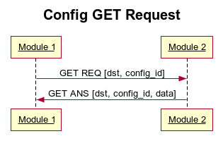
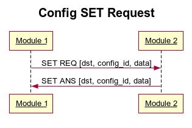
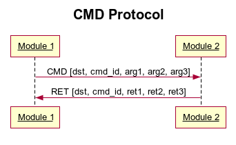

.. fcp documentation master file, created by
   sphinx-quickstart on Thu Aug  6 15:46:53 2020.
   You can adapt this file completely to your liking, but it should at least
   contain the root `toctree` directive.

Welcome to fcp's documentation!
===============================

.. toctree::
   :maxdepth: 2
   :caption: Contents:

        modules <modules.rst>

Indices and tables
==================

* :ref:`genindex`
* :ref:`search`
* :ref:`modindex`

Install
=======

Python3 version should be :math:`>3.7`.

Install fcp from pip:

.. code:: console

	$ pip install fcp

Usage
=====

.. program-output:: fcp --help

init
----

.. code:: console

    $ fcp init --help

.. program-output:: fcp init --help

read-dbc
--------

.. code:: console

    $ fcp read-dbc --help

.. program-output:: fcp read-dbc --help

* DBC: dbc file path
* JSON_FILE json spec file
* DEVICE_CONFIG device config json file

The read_dbc command will transform a DBC file into a json specification file.
Some required defaults will be added. See sec:usage:init for details on
which values are added.

Since the DBC files have no knowledge of devices and their IDs the
device_config file must be provided so that names can be attributed to
devices.

Example device_config:

.. code:: json

    {
        "0": "amk_0",
        "1": "amk_1",
        "2": "amk_2",
        "3": "amk_3",
        "8": "dcu",
        "9": "te",
        "10": "dash",
        "13": "arm",
        "14": "bms_master",
        "15": "bms_verbose",
        "16": "iib",
        "20": "ahrsf",
        "21": "ahrsr",
        "22": "gpsf",
        "23": "gpsr",
        "29": "isa"
    }
   

.. warning:: The read\_dbc command overrides existing json specification files. DBC and JSON spec merge are not yet implemented.

write-dbc
---------

.. code:: console

    $ fcp write_dbc --help

.. program-output:: fcp write_dbc --help

The write_dbc command will transform a json specification into a DBC file.

.. warning:: The write_dbc command overrides existing dbc files. DBC and JSON spec merge are not yet implemented.

validate
--------

.. code:: console

    $ fcp validate --help

.. program-output:: fcp validate --help

Json files are unstructured data files. To be sure that changes to the json spec are according to the specification the validate command checks the correctness of the json file.

c-gen
--------

.. code:: console

    $ fcp c_gen --help

.. program-output:: fcp c_gen --help

* TEMPLATES: Jinja2 template directory
* OUTPUT: C output directory
* JSON_FILE: json spec file
* SKEL: C skeleton directory

.. warning:: This command will override the contents of the output directory

Shortcuts
---------

* Ctrl + S : save
* Ctrl + O : open json

Protocol Overview
=================

Basics
------

can_ids.h
*********

.. code:: C

    /* LOG IDs */
    #define LOG_WRONG_LOG_ID 0
    #define LOG_WRONG_CFG_ID 1

    ...
    #include "te_can.h"
    #include "dash_can.h"
    ...
    #include "common.h"

    /* DEVICE IDs */
    ...
    #define DEVICE_ID_TE	9 
    #define DEVICE_ID_DASH	10 
    ...

    /* CAN Structure */
    typedef struct _can_t {
        ...
        #ifndef NO_TE
        dev_te_t te;
        #endif
        #ifndef NO_DASH
        dev_dash_t dash;
        #endif
        ...
        dev_common_t common;
    } can_t;

    void decode_can(CANdata msg, can_t *can);
    uint16_t dev_get_id();
    void dev_send_msg(CANdata msg);

**LOG_IDs** The *can\_ids.h* start with the definition of the LOG IDs. The names that can be used in the C library are constructed by prepending *LOG_* to the all capitalized name of the log that is defined in the JSON specification file.

**Device Includes** Next follows the includes of all device headers, which means that we only need to include *can_ids.h* to have access to all the *can_ids*.

**DEVICE IDs** In the section DEVICE IDs definition of the device
IDs can be found. This names are constructed by prepending *DEVICE_* to
the all capitalized name defined in the JSON specification file.

**CAN Structure** The CAN Structure section contains the
	*can_t* structure. This structure contains the all signals defined
	in the CAN bus.

	To reduce the memory requirements of this structure some devices can be
	excluded. Devices can be excluded by defining the NO_DEVICE_NAME, ex:
	-DNO_TE.

Example of signals access: *can.te.te_main.apps*.

From left to right the can_t structure, then the device name, followed by the
message name and finally the signals name.

**decode_can** The *decode_can* function can be used to
decode a CAN packet into the can_t structure. Example usage:

.. code:: C

    can_t can;
    ...
    while (True) {
        if (!can1_rx_empty()) {
            CANdata msg  = pop_can1();
            decode_can(msg, &can);
        }
        ...
    }

**dev_get_id** The *dev_get_id* is a function that must be defined by the user. This function returns the device ID used in the users code.

**dev_send_msg** The *dev_send_msg* is a function that must be defined by the user. This function sends a CAN frame to the bus.

Sending messages automatically
******************************

Messages can be automatically sent by using the device_send_msgs functions.
This function sends messages to the bus according to the configured period in
the FCP json.

It is recommended that the function be called at least as frequently as the most frequent message. 
The time resolution used is the millisecond so periods smaller than this cannot be used.

The data is going to be sent is the done present in the device field of the can_t structure. Fill this structure to update the data being sent.

.. code:: C

    volatile uint32_t time = 0;

    void timer1_callback() {
        time++
    }

    int main(void) {
        can_t can;

        config_timer1(1, 5);

        ...

        while (True) {
            ...
            can.te.apps = get_apps();
            te_send_msgs(can.te, time);
        }
    }

LOG Protocol
------------

The LOG packet can be used to report errors, warning or other type of information to the user.

In order for the information to be delivered to the user a string representation of the error must be available. Since sending strings through the network would be inefficient we maintain a table of identifiers and the corresponding strings. The ERR_CODE is the string identifier.

So that strings can deliver more information, there are up to 3 arguments that can be sent over the network. The formatting of strings with arguments could be implemented with a formatting scheme similar to C's *printf*.

.. code:: json

    {
        "logs": {
            "wrong_cfg_id": {
                "comment": "",
                "id": 1,
                "n_args": 0,
                "name": "wrong_cfg_id",
                "string": "Cfg code was not found"
            },
            "wrong_log_id": {
                "comment": "",
                "id": 0,
                "n\_args": 0,
                "name": "wrong_log_id",
                "string": "Log code was not found"
            }
        }
    }

+---+---+---+----+---+---+---+---+---+---+----+----+----+----+----+----+
| 0 | 1 | 2 |  3 | 4 | 5 | 6 | 7 | 8 | 9 | 10 | 11 | 12 | 13 | 14 | 15 |
+===+===+===+====+===+===+===+===+===+===+====+====+====+====+====+====+
|   LEVEL   | N_ARGS |  RESERVED |               ERR_CODE              |
+-----------+--------+-----------+-------------------------------------+
|                                 ARG 1                                |
+----------------------------------------------------------------------+
|                                 ARG 2                                |
+----------------------------------------------------------------------+
|                                 ARG 3                                |
+----------------------------------------------------------------------+

C Library
*********

Example usage of log reporting ordered in decreasing order of severity:

.. code:: C

	send_can1(logE(LOG_WRONG_LOG_ID, 0, 0, 0)); // Log Error
	send_can1(logW(LOG_WRONG_LOG_ID, 0, 0, 0)); // Log Warning
	send_can1(logI(LOG_WRONG_LOG_ID, 0, 0, 0)); // Log Info
	send_can1(logD(LOG_WRONG_LOG_ID, 0, 0, 0)); // Log Debug

The macros *logE*, *logW*, *logD*, *logI* are defined in the *can_log.h* file.

The LOG identifiers are defined in the *can_ids.h* file. Ex LOG ids: *LOG_WRONG_LOG_ID*, *LOG_WRONG_CFG_ID*.

CFG Protocol
------------

The config protocol allows to receive or define configuration parameters over the network.

In this protocol configuration parameters are identified by an integer id. Identifiers are not global, instead they are local to a device. This means that parameter 0 of device 1 may not be de same parameter as parameter 0 of device 2.

To receive a configuration parameter two packets are required: the REQ and the ANS. The REQ packet carries the request for information while the ANS packet carries the information itself.

Analogously to the GET to define a parameter two messages are needed: the REQ and the ANS.
In this case the REQ is a request for change and already carries the contents of the parameter that are to be defined. Consequentially the ANS packet is just a confirmation that the parameter was indeed changed.

CFG REQ GET

+---+---+---+---+---+---+---+---+---+---+----+----+----+----+----+----+
| 0 | 1 | 2 | 3 | 4 | 5 | 6 | 7 | 8 | 9 | 10 | 11 | 12 | 13 | 14 | 15 |
+===+===+===+===+===+===+===+===+===+===+====+====+====+====+====+====+
|        DST        |  RESERVED |                CFG ID               |
+-------------------+-----------+-------------------------------------+

CFG ANS GET

+---+---+---+---+---+---+---+---+---+---+----+----+----+----+----+----+
| 0 | 1 | 2 | 3 | 4 | 5 | 6 | 7 | 8 | 9 | 10 | 11 | 12 | 13 | 14 | 15 |
+===+===+===+===+===+===+===+===+===+===+====+====+====+====+====+====+
|        DST        |  RESERVED |                CFG ID               |
+-------------------+-----------+-------------------------------------+
|                              DATA 0:15                              |
+---------------------------------------------------------------------+
|                              DATA 16:31                             |
+---------------------------------------------------------------------+

CFG REQ SET

+---+---+---+---+---+---+---+---+---+---+----+----+----+----+----+----+
| 0 | 1 | 2 | 3 | 4 | 5 | 6 | 7 | 8 | 9 | 10 | 11 | 12 | 13 | 14 | 15 |
+===+===+===+===+===+===+===+===+===+===+====+====+====+====+====+====+
|        DST        |  RESERVED |                CFG ID               |
+-------------------+-----------+-------------------------------------+
|                              DATA 0:15                              |
+---------------------------------------------------------------------+
|                              DATA 16:31                             |
+---------------------------------------------------------------------+

CFG ANS SET

+---+---+---+---+---+---+---+---+---+---+----+----+----+----+----+----+
| 0 | 1 | 2 | 3 | 4 | 5 | 6 | 7 | 8 | 9 | 10 | 11 | 12 | 13 | 14 | 15 |
+===+===+===+===+===+===+===+===+===+===+====+====+====+====+====+====+
|        DST        |  RESERVED |                CFG ID               |
+-------------------+-----------+-------------------------------------+
|                              DATA 0:15                              |
+---------------------------------------------------------------------+
|                              DATA 16:31                             |
+---------------------------------------------------------------------+

C Library
*********

To use the C CFG Protocol implementation an array which can hold all parameters must be created. The number of parameters can be conveniently found in the .h file of the device. Since parameters can use up to 32 bit the type of the table should be *int32_t*.

For automatic handling of configurations the cfg_dispatch function should be used. The cfg_dispatch must be called every time a CAN message is retrieved from the bus.  function should be used. The cfg_dispatch must be called every time a CAN message is retrieved from the bus. 

.. code:: C

    uint32_t parameters[CFG_BMS_MASTER_SIZE] = {0};
    cfg_config(parameters, CFG_BMS_MASTER_SIZE);

    while (True) {
        ...
        if (!can1_rx_empty()) {
            CANdata msg = pop_can1();
            cfg_dispatch(msg);
        }

    }

To make use of a configuration access the parameter table with the macros defined in the device .h .

.. code:: C

	...
	uint32_t version = parameters[CFG_BMS_MASTER_VERSION];
	...

The *cfg_config* and *cfg_dispatch* can be found in the *can_cfg.h* file.

The CFG device macros can be found in the device .h. Ex: *bms_master_can.h*

CMD Protocol
------------

The CMD protocol can be used to request actions of the car ECU's. Two packets are used in this protocol: the SEND and the RET.

Actions are identified by an integer ID. This ID is local to the ECU. This means that command 0 can do different actions if different ECU's are requested.

The SEND packet is the one that can be used to request an action. It can also carry 3 16 bit arguments to be used by the ECU.

The RET packet confirms that the action was executed. It can also send 3 16 bit return values.

This protocol tries to emulate the execution of procedures remotely similar to RPC protocols. It is however limited by the three input arguments and the three output values.

CMD SEND

+---+---+---+---+---+---+---+---+---+---+----+----+----+----+----+----+
| 0 | 1 | 2 | 3 | 4 | 5 | 6 | 7 | 8 | 9 | 10 | 11 | 12 | 13 | 14 | 15 |
+===+===+===+===+===+===+===+===+===+===+====+====+====+====+====+====+
|        DST        |  RESERVED |                CMD ID               |
+-------------------+-----------+-------------------------------------+
|                                ARG 1                                |
+---------------------------------------------------------------------+
|                                ARG 2                                |
+---------------------------------------------------------------------+
|                                ARG 3                                |
+---------------------------------------------------------------------+

CMD RET

+---+---+---+---+---+---+---+---+---+---+----+----+----+----+----+----+
| 0 | 1 | 2 | 3 | 4 | 5 | 6 | 7 | 8 | 9 | 10 | 11 | 12 | 13 | 14 | 15 |
+===+===+===+===+===+===+===+===+===+===+====+====+====+====+====+====+
|        DST        |  RESERVED |                CMD ID               |
+-------------------+-----------+-------------------------------------+
|                                RET 1                                |
+---------------------------------------------------------------------+
|                                RET 2                                |
+---------------------------------------------------------------------+
|                                RET 3                                |
+---------------------------------------------------------------------+

C Library
*********

To send a CMD using the CMD protocol C library use the *cmd_send* function.

.. code:: C

	...
	CANdata msg = cmd_send(CMD_TOGGLE_PUMPS, DEVICE_ID_CCU, 0, 0, 0);
	send_can1(msg);
	...

To handle messages using the CMD Protocol C library a *cmd_handle* function must be defined.

.. code:: C

    multiple_return_t cmd_handle(
        uint16_t id, 
        uint16_t arg1, 
        uint16_t arg2, 
        uint16_t arg3) 
    {

        multiple_return_t mt = {0};
        if (id == CMD_TOGGLE_PUMPS) {
            PUMP_LEFT ^= 1;	
        }
        else if (id == CMD_ADD) {
            mt.arg1 = arg1 + arg2
        }
        else {
            CANdata msg = logE(LOG_WRONG_CMD_ID);
            send_can1(msg);
        }

        return mt;
    }

The *cmd_handle* function will automatically be called by *cmd_dispath* which must be called every time a message is retrieved from the bus. 

.. code:: C

    while (True) {
        if (!can1_rx_empty()) {
            CANdata msg = pop_can1();
            cmd_dispatch(msg);
        }
    }

CMD vs CFG protocol
-------------------

The CMD and CFG protocols are very similar, this means that the question of when to use each one is a pertinent one.

The CFG protocol is intended for changing parameters only. Ex: maximum torque limit, upper apps 1 threshold, sensor calibration data, ...

The C library works by directly changing memory values without develop intervention which is convenient since no user code is needed to handle the configurations.

Schema files
-------------------

Fcp schema files can be written in json. See :download:`example1.json <../json/example1.json>` for an example of a schema file.

Schemas can alternatively be written in yaml. See :download:`example1.yaml <../json/example1.yaml>` for an example of a yaml schema file.

Note the `!include` directive in the example yaml file. This directive can be used to include other yaml files. This is useful to split a large schema into smaller more manageable files.
